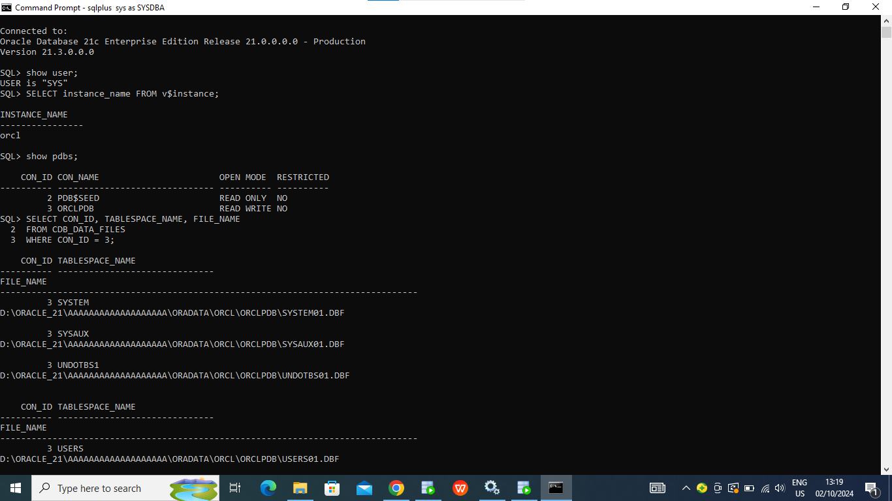
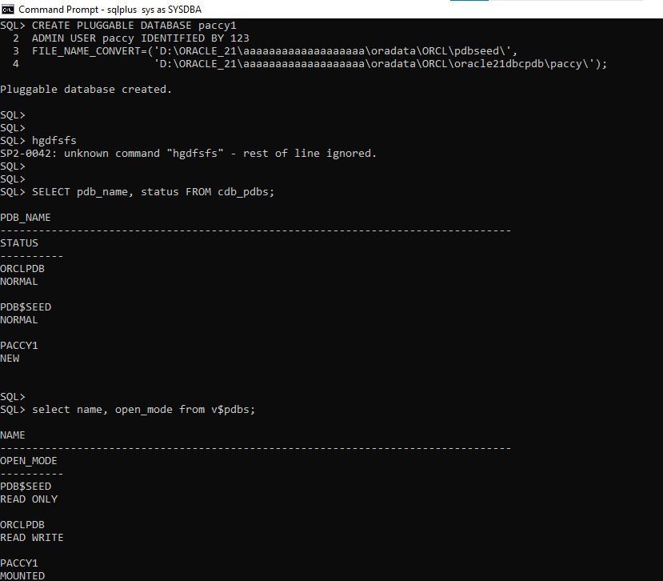
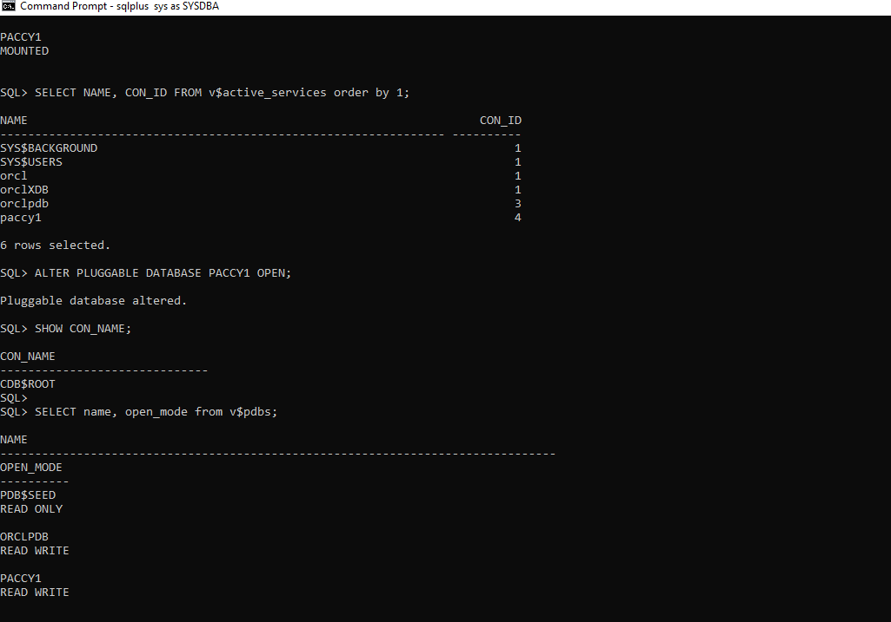
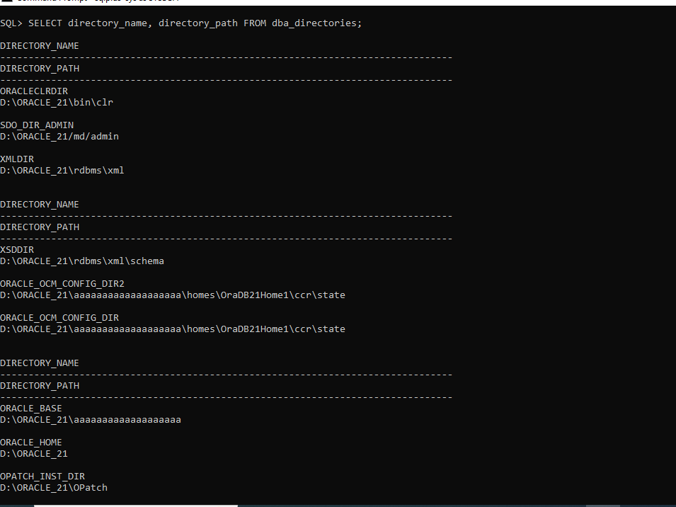
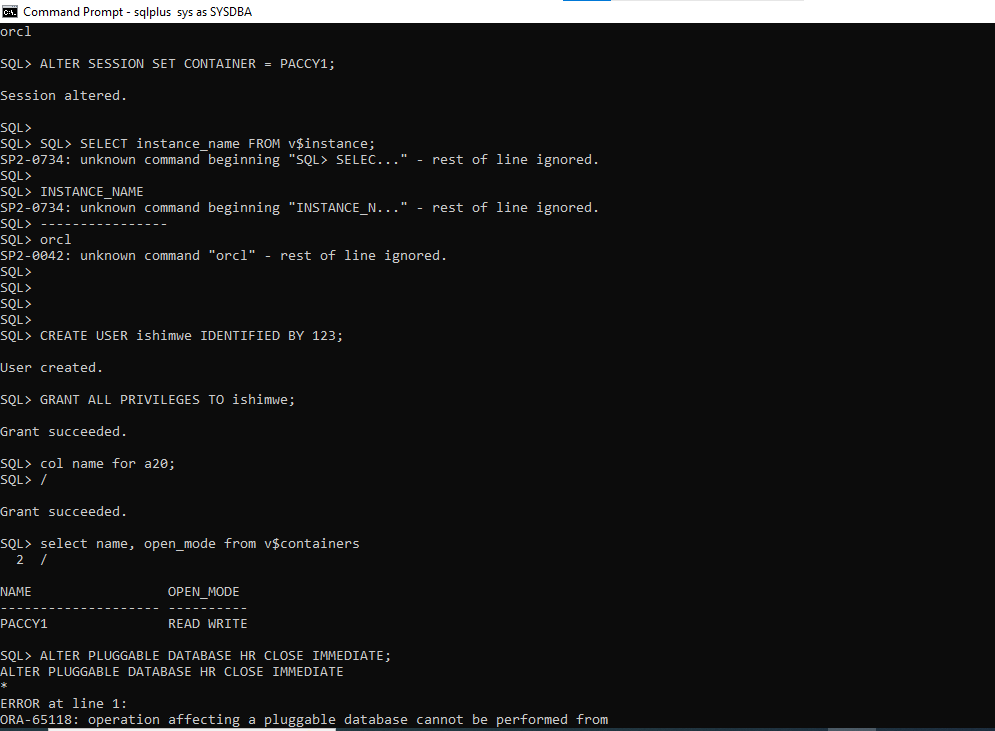
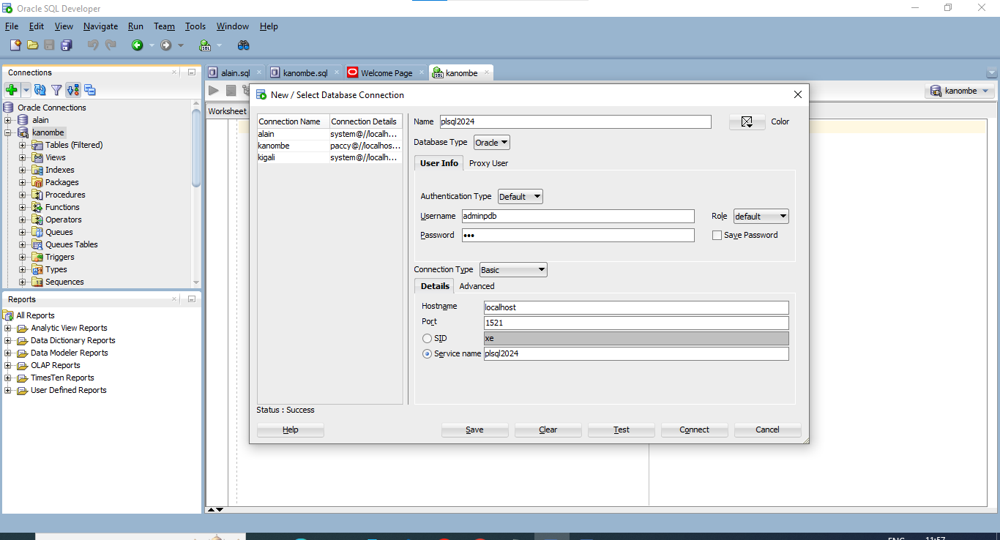
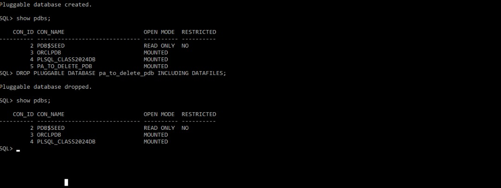
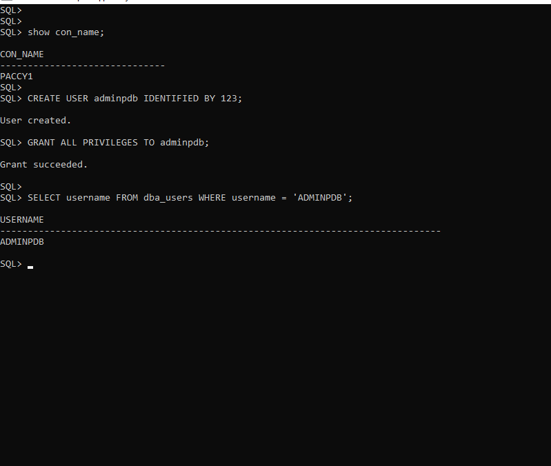
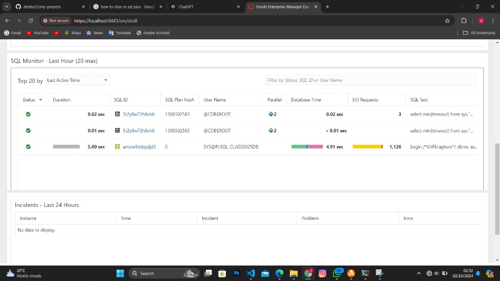

 Manager dashboard

CREATING NEW PLUGGABLE USER
and Displaying of all PDBs.

# Image from Sql*plus

# pluggable image

  

  # Mount paccy1
  

# Show Path

# Altering paccy1 and new User

# connecting pdb2024 with admin in oracle

# Delete pdb

# Show con_name

# Creating Oracle Enterprise

##  2

# END!
